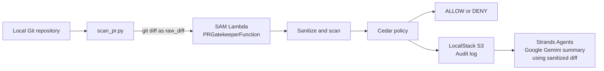

# PR Gatekeeper

[](https://www.python.org/)
[](https://docs.aws.amazon.com/serverless-application-model/)
[](https://localstack.cloud/)


PR Gatekeeper is a self-contained, local serverless security scanner for hackathons. It evaluates Git changes before they are committed or pushed, detects likely secrets and policy violations, records an audit decision in local S3, and prints an AI-generated security summary.

The workflow runs the application in an AWS Lambda-compatible Python 3.11 Docker container through AWS SAM CLI. LocalStack supplies the local S3 endpoint used for audit logs. The summary request is sent to Google Gemini through the Strands Agents SDK, so a valid Gemini API key and network access are required for that step.

> **Current model:** `app.py` configures Strands with `gemini-3.5-flash-lite`. Update the model ID in `app.py` if your account uses a different supported Gemini model.

## How It Works



The normal CLI path does **not** require `sam local start-api`, a running API server, or a public webhook tunnel such as ngrok. `scan_pr.py` writes a temporary API Gateway-style event and directly invokes the Lambda container with `subprocess.run`:

```text
scan_pr.py -> sam local invoke -> Docker Lambda -> Cedar / LocalStack / Gemini
```

## Architecture

- **CLI trigger:** `master_script/scan_pr.py` captures the current repository diff, creates `events/temp_event.json`, and invokes SAM directly.
- **Compute:** `template.yaml` defines the `PRGatekeeperFunction` Lambda using the `python3.11` runtime, with a 90-second timeout and 512 MB memory. Gemini requests have a one-minute timeout.
- **Diff acquisition:** `app.py` accepts a direct `raw_diff`, can fetch a GitHub `pull_request.diff_url`, or falls back to local Git diff collection through `sanitizer.py`.
- **Sanitization:** `sanitizer.py` detects `AWS_KEY`, `GENERIC_SECRET`, and `COMMITTED_ENV_FILE` findings, then redacts matching assignments before the diff is sent to Gemini.
- **Authorization:** `policy_evaluater.py` loads `security.cedar` using an absolute module-relative path and evaluates the findings with Cedar. The native Cedar call runs in a bounded worker process and fails closed if it errors or exceeds five seconds.
- **AI summary:** Strands Agents sends the sanitized diff and scanner findings to the configured Gemini model. The Lambda prints the three-section Markdown report directly to the SAM output.
- **Audit logging:** `logger.py` writes each decision to the LocalStack S3 bucket `pr-gatekeeper-audits` under `audit_logs/`.

## Prerequisites

Install or configure the following on the host machine:

- [Docker Desktop](https://www.docker.com/products/docker-desktop/) running
- [AWS SAM CLI](https://docs.aws.amazon.com/serverless-application-model/latest/developerguide/install-sam-cli.html)
- [LocalStack](https://docs.localstack.cloud/getting-started/installation/) running on port `4566`
- Python 3.11 or newer
- Git
- A valid `GEMINI_API_KEY`

The Lambda container reaches LocalStack through `http://host.docker.internal:4566`. This is injected by `template.yaml` as `LOCALSTACK_ENDPOINT`. The template also injects `GEMINI_API_KEY` from the `GeminiApiKey` parameter.

## Getting Started

### 1. Clone and enter the project

```powershell
git clone <repository-url>
Set-Location pr-gatekeeper
```

### 2. Install Python dependencies

Use a virtual environment for local tooling and module checks:

```powershell
py -3.11 -m venv .venv
.\.venv\Scripts\Activate.ps1
python -m pip install --upgrade pip
pip install -r requirements.txt
```

SAM installs the application dependencies into the build image during the SAM build.

### 3. Start LocalStack

With Docker directly:

```powershell
docker run --rm -it -p 4566:4566 localstack/localstack
```

Or start LocalStack Desktop and ensure its edge port is `4566`.

### 4. Configure Gemini

For SAM local invocation, provide the key through the template parameter:

```powershell
sam build --use-container
sam local invoke PRGatekeeperFunction `
  --parameter-overrides GeminiApiKey=$env:GEMINI_API_KEY `
  -e events/events.json
```

Alternatively, replace the placeholder `GeminiApiKey` default in `template.yaml` for a local-only hackathon setup. Do not commit a real API key to source control.

### 5. Build the SAM application

Run this after dependency or source changes. `--use-container` builds with the Lambda-compatible Python 3.11 image and is the recommended command for this project:

```powershell
sam build --use-container
```

### 6. Run a scan from a repository

From the PR Gatekeeper project directory:

```powershell
python master_script\scan_pr.py
```

The script reads a branch-aware diff from the current working directory, writes the event file, and invokes the Lambda from the configured SAM project directory. On `main` or `master`, it compares `HEAD~1` with `HEAD`. On another branch, it compares the detected base branch (`main`, `master`, or their `origin/*` variants) with `HEAD` using a three-dot merge-base diff. If the selected target is unavailable, it falls back to `HEAD~1` versus `HEAD`.

Build first, then run the scan:

```powershell
sam build --use-container
python master_script\scan_pr.py
```

## Global `gatekeeper` Alias

The CLI is designed to be called from any local Git repository. On Windows PowerShell, add a function to `$PROFILE` that points to this checkout:

```powershell
function gatekeeper {
  & python "C:\Users\<user>\Desktop\wemakeedevs_aws\pr-gatekeeper\master_script\scan_pr.py"
}
```

Reload the profile or open a new terminal, then run this from any Git repository:

```powershell
gatekeeper
```

The script resolves the SAM project path relative to `master_script/scan_pr.py` while using the current working directory for the repository being scanned. You can move the project without editing `GATEKEEPER_DIR`; update only the PowerShell alias path if the checkout location changes. The function can therefore be called from any local Git repository:

```powershell
Set-Location C:\path\to\another-repository
gatekeeper
```

## Direct Python Mode Without Docker

To skip SAM and Docker, run `app.py` directly **from the PR Gatekeeper project directory** and pass the repository path as its argument:

```powershell
Set-Location C:\Users\<user>\Desktop\wemakeedevs_aws\pr-gatekeeper
python app.py C:\path\to\repository
```

This mode uses the same branch-aware Git diff, sanitizer, Cedar policy, audit logging, and Gemini summary pipeline. It requires the Python dependencies from `requirements.txt`, a configured `GEMINI_API_KEY`, and LocalStack on port `4566` for audit logs. If LocalStack is unavailable, the scan still continues but the audit upload is skipped.

## Windows Subprocess Compatibility

`scan_pr.py` uses `shell=True`, `encoding="utf-8"`, and `errors="replace"` when invoking SAM. These settings prevent Windows' default `cp1252` decoding from crashing when Docker, emojis, or Strands AI output contains characters that are not representable in the console code page.

## Event Payload

`events/temp_event.json` is generated by `scan_pr.py`. Its schema is:

```json
{
  "body": "{\"raw_diff\": \"<git diff text>\", \"repository\": {\"full_name\": \"<repository folder name>\"}}"
}
```

Important details:

- The outer `body` value is a JSON string, matching an API Gateway request.
- The decoded body contains `raw_diff`, which is the captured Git diff.
- The decoded body contains `repository.full_name`, currently populated with the local repository folder name.
- `app.lambda_handler` also accepts a decoded dictionary body, an optional `repo_path`, and GitHub webhook payloads containing `pull_request.diff_url`.

For direct testing, `events/events.json` can contain the same outer structure with a small sample diff.

## Security Policy

The policy in `security.cedar` permits the developer to merge `PullRequest::"incoming_pr"` when the action is `Action::"merge_pull_request"` and no blocking context applies. It issues a `DENY` when either condition is true:

- `context.has_leaked_secret == true`
- `context.vulnerability_count > 0`

For example, a diff containing an AWS credential pattern produces a finding, sets `has_leaked_secret` to `true`, and is denied. Cedar evaluation fails closed if the policy cannot be read or evaluated.

## Scanner Findings

The local regex scanner currently reports:

| Finding              | Detected pattern                                                                                            |
| -------------------- | ----------------------------------------------------------------------------------------------------------- |
| `AWS_KEY`            | Assignments to `aws_access_key_id` or `aws_secret_access_key` with a quoted value of at least 16 characters |
| `GENERIC_SECRET`     | Assignments to `api_key`, `secret`, `password`, or `bearer_token` with a quoted value                       |
| `COMMITTED_ENV_FILE` | A diff adding or modifying a `.env` file                                                                    |

Matching secret assignments are replaced with `<REDACTED_SECRET>` before the diff is included in the AI prompt. This scanner is intentionally lightweight and should complement, not replace, production secret scanning tools.

## Audit Logs

`logger.py` creates the `pr-gatekeeper-audits` bucket if needed and writes objects such as:

```text
audit_logs/audit_20260919_160119_DENY.json
```

Each JSON audit record has this structure:

```json
{
  "timestamp": "2026-09-19T16:01:19.123456+00:00",
  "decision": "DENY",
  "has_leaked_secret": true,
  "vulnerability_count": 1,
  "detected_issues": ["GENERIC_SECRET"],
  "pr_metadata": {
    "target_repo": "/var/task"
  }
}
```

The S3 client uses short connection and read timeouts and limited retries. If LocalStack is unavailable, the failure is logged and the scan continues.

To inspect the bucket with the AWS CLI configured for LocalStack:

```powershell
aws --endpoint-url http://localhost:4566 s3 ls s3://pr-gatekeeper-audits/audit_logs/
```

## Lambda and Webhook Invocation

The Lambda handler supports the local direct-diff flow and webhook-style requests. A direct request can use:

```json
{
  "body": "{\"raw_diff\": \"diff --git ...\", \"repo_path\": \"C:/repo\"}"
}
```

A GitHub webhook-style request can provide the diff URL under `pull_request`:

```json
{
  "body": "{\"pull_request\": {\"diff_url\": \"https://github.com/example/project/pull/1.diff\"}}"
}
```

The handler returns an API Gateway-style response with `statusCode` and a JSON body. The Cedar decision, audit result, and AI summary are printed in the Lambda logs.

## Troubleshooting

### LocalStack connection failures

Confirm Docker and LocalStack are running and port `4566` is available:

```powershell
docker ps
Test-NetConnection localhost -Port 4566
```

Inside the Lambda container, use `host.docker.internal`, not `localhost`, to reach a service running on the host.

### No diff detected

Run these commands from the repository you intend to scan:

```powershell
git status
git branch --show-current
git log --oneline -2
```

On `main` or `master`, the CLI compares `HEAD~1` to `HEAD`. On other branches, it compares the detected base branch to `HEAD` with a merge-base diff. Make sure the repository has at least two commits and that the base branch exists locally.

### Gemini summary unavailable

Check that `GEMINI_API_KEY` is valid, is passed through `GeminiApiKey`, and that the host has outbound network access. Cedar and audit logging still run independently of the AI summary call.

### Cedar timeout

A Cedar timeout is treated as `DENY`. Check that `security.cedar` is included in the SAM build output and that the `cedarpy` dependency was installed successfully.

## Project Layout

```text
.
├── app.py                    # Lambda handler and PR gatekeeper pipeline
├── logger.py                 # LocalStack S3 audit logging
├── policy_evaluater.py       # Cedar policy loading and authorization
├── sanitizer.py              # Git diff collection and secret scanning
├── security.cedar            # Cedar authorization policy
├── template.yaml             # AWS SAM function and environment configuration
├── requirements.txt          # Python dependencies
├── master_script/
│   └── scan_pr.py            # Direct-invocation CLI wrapper
├── events/
│   ├── events.json           # Sample invocation event
│   └── temp_event.json       # Generated CLI event
└── test/                     # Local test and fixture files
```

## Limitations

- Detection is regex-based and can produce false positives or miss nonstandard secret formats.
- LocalStack is intended for local development and does not provide production S3 durability.
- Gemini summaries require an external API call and may add latency or incur usage costs.
- The current CLI uses a machine-specific absolute project path in `GATEKEEPER_DIR`; update it when installing elsewhere.
- The generated event is a local API Gateway-style simulation, not a complete GitHub webhook verifier.

